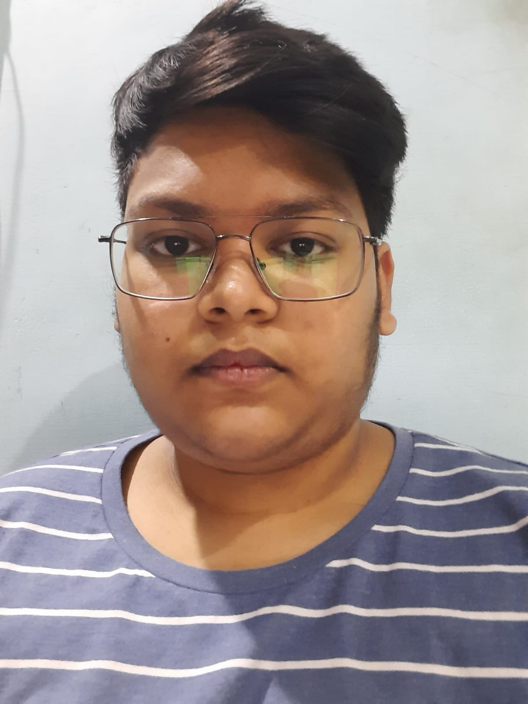

# NIDMANURI SAI ADARSH

*****

Hi my name is **NIDMANURI SAI ADARSH** and i am studing my **BACHELORS OF TECHNOLOGY** at my college **INDIAN INSTITUTE OF TECHNOLOGY GOA**  
and i am from *Vijayawada* located in the state *Andhra Pradesh*. My branch at **IITGOA** is *COMPUTER SCIENCE AND ENGINNERING*. My hobbies are **playing**  
**chess** **watching Tv and Reading Novels and learning Facts *etc***. We have been called to our campus on first week of june and we are very happy to go to our campus.

*****

# Education
|Year of Graduation|Degree|Institution|
|:---:|:---:|:---:|
|2024|B. Tech.|Indian Institute of Technology Goa|
|2021|12th standard or equivalent|FIITJEE junior college|
|2019|10th standard or equivalent|FIITJEE|

*****

# 1st-year Courses@IITGoa
## Autumn Semester 2021-2022
* **MTH101**:\
  Calculus by *Sandipan de*
* **PH101**:\
  Quantum Physics and Applications
* **CS101**:\
  Introduction to Computing by [*clint P george*](https://clintpgeorge.github.io/cs-101/autumn-2021/)
* **CH101**:\
  Physical Chemistry by *rajamitra*
* **CH102**:\
  Inorganic and Organic Chemistry by *rishikesh narayan*
* **CH104**:\
  Chemistry Lab
* **HS102**:\
  Foundation Programme in Humanitites and Social Sciences
* **CS100**:\
   Introduction to Profession
* **NO101**:\
   National Sports Organisation by *santosh*

## Spring Semester 2021-2022
* **MTH1021**:\
  Introductory Algebera by *Kalpesh Haria*
* **MTH1022**:\
  Ordinary differential equation 
* **CS102**:\
  Software Tools by [*Clint P George*](https://clintpgeorge.github.io/cs-102/spring-2022/)
* **PH102**:\
  Elecricity and Magnetism by *Vaibhav wasnik*
* **PH103**:\
  Physics lab
* **EE101**:\
  Introduction to EE engineering by *Sheron F*
* **BIO101**:\
  Introductory Biology by *rishikesh narayan*
* **ME102**:\
   Engineering drawing and introduction to graphics aided drawing
* **NO102**:\
   National Sports Organisation by *santosh*

******

# Hobbies
    Including Games
1. [Cricket](https://en.wikipedia.org/wiki/Cricket)
2. [Football](https://en.wikipedia.org/wiki/Football)
3. [Mobile games](https://en.wikipedia.org/wiki/Mobile_game)\
    -FREE FIRE\
    -BGMI
4. [Novels](https://en.wikipedia.org/wiki/Novel)
5. [playing Chess](https://en.wikipedia.org/wiki/Chess)

